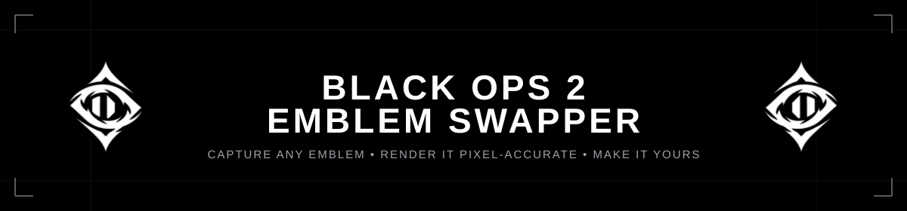
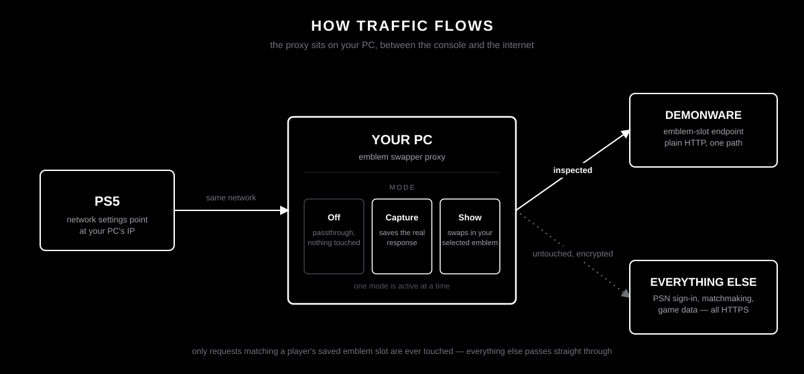
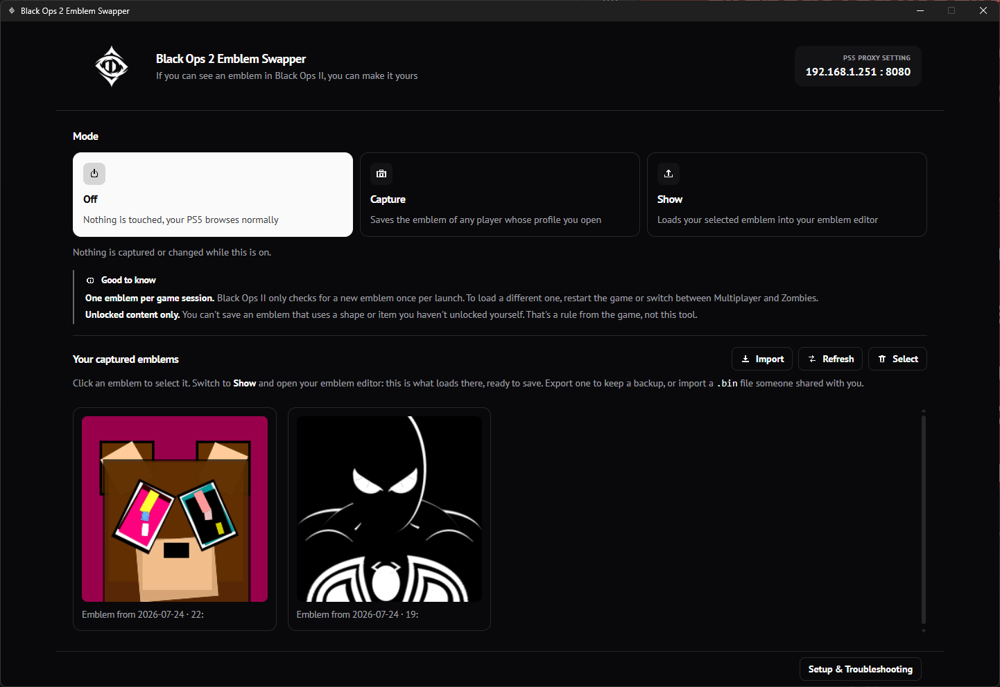
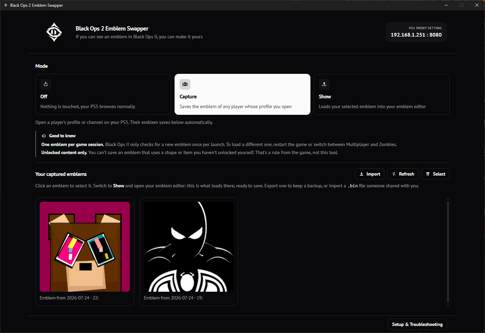
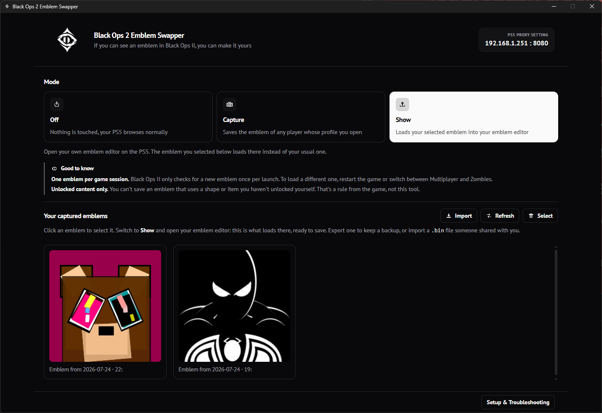

<p align="center">
  
</p>

# Black Ops 2 Emblem Swapper

A desktop app for copying another player's Black Ops II emblem onto your own PS5 account.

You capture the emblem while looking at that player's profile, then load it into your own in-game emblem editor and save it there. From that point it's yours, the same as anything else you built in the editor by hand.

Built for personal use, on your own PS5 and your own home network.

## What's new

- **Capture notifications** pop up as native Windows toasts the moment an emblem lands in your library, bundled into one if several land in a burst.
- **Find Duplicates** clears out byte-identical re-captures in one pass.
- **Backup / Restore** zips your whole library to a file and back, additively, so restoring never overwrites what's already there.
- **Quick Diagnostics**, under Setup & Troubleshooting, automates the proxy, LAN IP, network category, and firewall checks.
- A larger window and a cleaner interface throughout.

## How it works

Black Ops II fetches emblem data over plain HTTP, from Treyarch's Demonware servers. There's no encryption on that one endpoint, so a small proxy on your PC can sit between the console and the internet and watch that single request pass by.

The app runs that proxy. You point your PS5's network settings at your PC's IP address, and every other request your console makes still goes straight out to the internet untouched. HTTPS traffic, including PSN sign-in and matchmaking, is tunneled through byte for byte and never decrypted. The proxy only pays attention to one thing: requests whose path matches a player's saved emblem slot.

<p align="center">
  
</p>

Three modes control what happens to those requests:

| Mode | Behavior |
|---|---|
| Off | Nothing is touched. The proxy is fully transparent. |
| Capture | The real response from Demonware is saved to disk before being passed along. |
| Show | The real response is swapped out for whichever emblem you've selected in the app. |

Switch to Capture, open a player's profile, and their emblem lands in your library automatically. Select it, switch to Show, and open your own emblem editor. Whatever slot the game asks for, it gets your selected emblem back instead of your own. Save it in the editor and it's permanently yours.

### The emblem format

Each captured slot is a 1408-byte blob: 32 fixed layer records, 44 bytes each. A layer holds a shape ID, an RGBA color, a position, a rotation, and a scale, packed as raw little-endian integers and floats. None of this is documented anywhere. Working out what each field actually meant, and matching the game's own renderer pixel for pixel, took writing values directly into the game's memory and comparing screenshots against the app's own output.

A few things about it aren't what you'd guess:

- Scale isn't linear. The stored value is an exponent: actual scale is `2^value`, so `0` fills the whole box and each step up or down doubles or halves the size.
- Rotation is stored in degrees, clockwise, but has to be negated to match how standard image libraries rotate counter-clockwise.
- The "outlined" flag doesn't draw a filled shape with a border. It draws only the edge: a thin ring computed by dilating and eroding the shape's silhouette and keeping the difference.

The renderer reproduces all of this from scratch in Rust, including a hand-written bicubic resampler and morphological filter, so a captured `.bin` file renders identically to what the game itself would show.

## Using it

1. Turn on Capture mode.
2. On your PS5, open the profile or channel of the player whose emblem you want. It's saved automatically.
3. Click the captured emblem in your library to select it.
4. Turn on Show mode.
5. Open your own emblem editor on the PS5. The selected emblem loads in place of whatever you'd normally see there.
6. Save it, same as anything you made yourself.

|  |  |  |
|---|---|---|
|  |  |  |
| Off | Capture | Show |

Full setup, including the exact PS5 network settings screen and firewall troubleshooting, is in [docs/INSTALL.md](docs/INSTALL.md) and built into the app itself under Setup & Troubleshooting.

**Two things worth knowing:**

- Black Ops II only checks for a new emblem once per game launch. To load a different one after the first, restart the game, or switch to Zombies and back to Multiplayer.
- If a captured emblem uses a shape, rank icon, or weapon qualification you haven't personally unlocked, the game may refuse to load or save it. That's the game enforcing it, not something this tool can work around.

## Library tools

A few tools around the library itself, past just capturing and showing:

- **Find Duplicates** groups captures that are byte-for-byte identical (ignoring the HTTP response header, so a re-capture of the same emblem still matches) and lets you clear out the extras in one pass.
- **Backup / Restore** zips your whole library to a single file and back. Restoring is additive: it always adds the backup's emblems as new entries rather than overwriting what's already there, so restoring the same backup twice never loses anything.
- **Quick Diagnostics**, under Setup & Troubleshooting, checks the proxy port, LAN IP, network category, and firewall rule automatically instead of walking through them by hand.

## Architecture

The app is a native Tauri window: a Rust backend handling the proxy, file storage, and rendering, talking to a React and TypeScript frontend over Tauri's IPC bridge. No web server, no browser tab, no polling loop. The Rust side pushes events to the UI the moment something happens.

```
app/
  src/                      React frontend
    components/             UI components
    lib/                    Tauri IPC bindings and shared types
  src-tauri/
    src/
      proxy.rs              the MITM proxy itself
      storage.rs            captured emblems and their labels on disk
      backup.rs             zipping the library to a file and back
      diagnostics.rs        the automated connection checks
      broadcast.rs          which emblem is currently selected
      state.rs              current mode: off, capture, or show
      emblem/
        format.rs           binary layer record parsing
        render.rs           the pixel-accurate renderer
        shape_map.rs        shape ID to reference-image lookup
      commands.rs           the Tauri commands the frontend calls
    resources/
      reference_shapes/     261 reference glyphs used to render captured emblems
```

## Building from source

You'll need [Rust](https://rustup.rs) and [Node.js](https://nodejs.org).

```
cd app
npm install
npm run tauri dev
```

`npm run tauri build` produces a standalone installer under `app/src-tauri/target/release/bundle`.

## Android

The same codebase builds as an Android APK, so the proxy can run on a phone instead of a PC. You'll need [Android Studio](https://developer.android.com/studio) (SDK + NDK installed), a JDK, and the Rust Android targets:

```
rustup target add aarch64-linux-android armv7-linux-androideabi i686-linux-android x86_64-linux-android
```

Build the release bundles (signed automatically with the release keystore, see below):

```
cd app
npm run tauri android build --apk --aab
```

Outputs land under `app/src-tauri/gen/android/app/build/outputs/`: the **APK** (`apk/universal/release/`) is for direct distribution and sideloading; the **AAB** (`bundle/release/`) is what the Play Store requires.

### Release signing

Distributed builds are signed with the release keystore at `app/android-upload.keystore`. Its credentials live in `app/src-tauri/gen/android/keystore.properties`, and both files are gitignored. **Back both up somewhere safe** — every future update must be signed with this same key, and if it's lost, existing installs can never be updated (users would have to uninstall and lose their data). If `keystore.properties` is missing, the build falls back to an unsigned release APK.

A phone with a debug-signed build installed can't update to the release-signed build (different signature) — uninstall the old one first.

### Testing without distribution

For quick local testing you can also sign an unsigned build with your Android debug key (created automatically by Android Studio, usually at `%USERPROFILE%\.android\debug.keystore`):

```
zipalign -f 4 app-universal-release-unsigned.apk aligned.apk
apksigner sign --ks ~/.android/debug.keystore --ks-pass pass:android --out bo2-emblem-swapper-1.0.0.apk aligned.apk
```

`zipalign` and `apksigner` ship with the Android SDK under `build-tools/<version>/`.

### On a phone

The APK supports Android 7.0+ and all common CPU architectures. Copy it to the phone and install it (allowing "unknown sources" when prompted), or install over USB with `adb install bo2-emblem-swapper-1.0.0.apk`. The phone just needs to be on the same Wi-Fi as the PS5: the app shows the phone's real LAN IP, and that IP with port `8080` goes into the PS5's proxy settings. Keep the app in the foreground while capturing — Android suspends background apps, which would stop the proxy mid-session.

### On the Android emulator

The emulator sits behind its own NAT, so the IP it shows (`10.0.2.16`) is unreachable from a real PS5. To test the proxy for real from the emulator, forward the port through the host PC:

```
adb forward tcp:8080 tcp:8080
netsh interface portproxy add v4tov4 listenaddress=<PC LAN IP> listenport=8080 connectaddress=127.0.0.1 connectport=8080
netsh advfirewall firewall add rule name="BO2 Emblem Proxy (emulator)" dir=in action=allow protocol=TCP localport=8080
```

Then point the PS5 at the PC's LAN IP, port `8080`. Traffic flows PS5 → PC → emulator → the internet. Remove the forwarding afterwards with `netsh interface portproxy delete v4tov4 listenaddress=<PC LAN IP> listenport=8080` and by deleting the firewall rule. Note the emulator needs hardware acceleration enabled (SVM/VT-x in BIOS, plus the AEHD driver or Windows Hypervisor Platform).

Emblems captured on Android live in that app's own storage, separate from the desktop library. Use Export or Backup to move them.

## Scope

This only intercepts Black Ops II's own emblem-storage requests. Everything else passes through unmodified, including PSN authentication, which stays encrypted the whole time. Emblem data isn't private: it's the same thing already displayed on other players in-game. This project isn't affiliated with Activision, Treyarch, or Sony.

## License

MIT. See [LICENSE](LICENSE).
